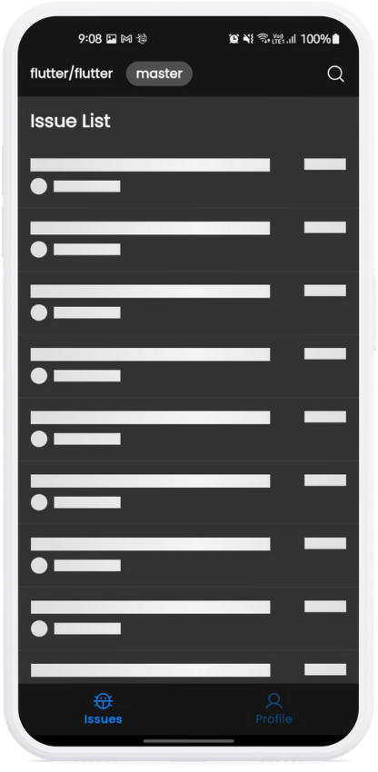
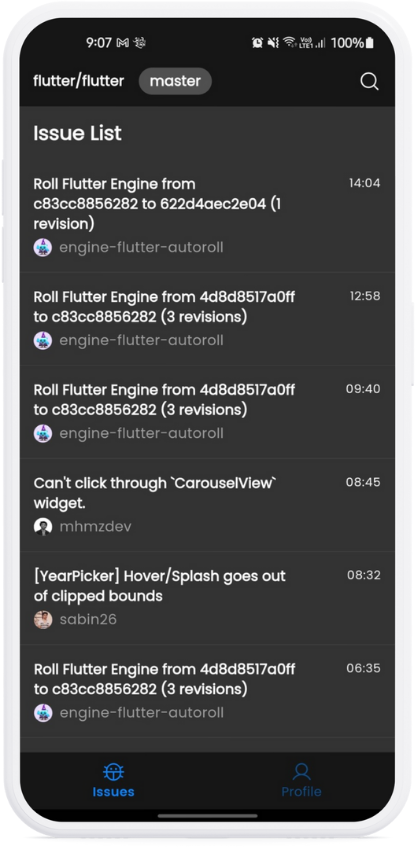
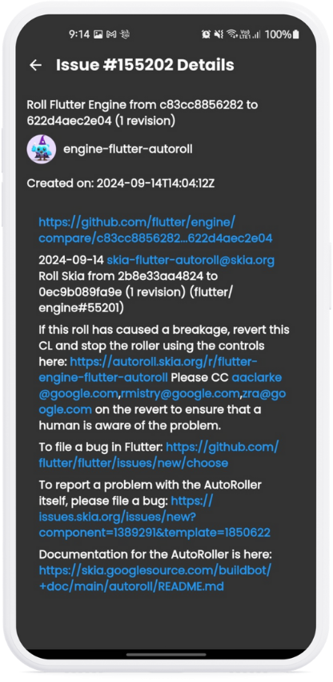
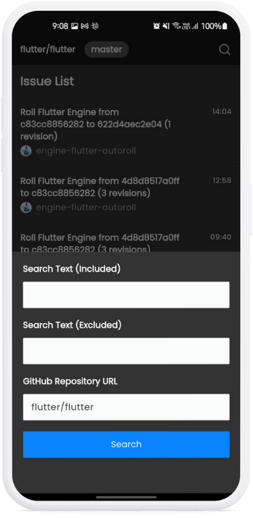
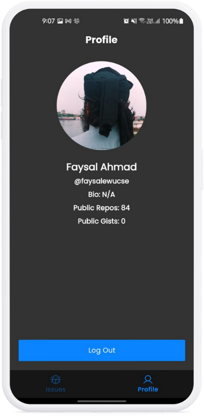

# GitHub Issue Tracker

GitHub Issue Tracker is a Flutter app that allows users to track issues across multiple GitHub repositories. The app provides a centralized interface for viewing, searching, and managing issues from various repositories on GitHub.

## Features

- **View Issues**: Display a list of issues from any GitHub repository.
- **Search Issues**: Search issues by title and filter results.
- **Issue Details**: View detailed information about a specific issue, including the issue title, description, creation date, and the user who created it.
- **Pagination Support**: Browse through issues across different pages with support for loading more as needed.
- **User Avatars**: Display the GitHub user’s avatar and username in each issue card.
- **Shimmer Effect**: While loading data, the app displays a shimmer effect placeholder for a smooth user experience.

## Screenshots

### Home Screen


### Issue List


### Issue Details


### Search Bottom Sheet


### Profile Screen



## Getting Started

### Prerequisites

- [Flutter SDK](https://flutter.dev/docs/get-started/install)
- [Dart SDK](https://dart.dev/get-dart)
- A GitHub API token (optional, for higher rate limits)

### Installation

1. Clone this repository:
   ```bash
   git clone https://github.com/your-username/github-issue-tracker.git
   ```
2. Navigate to the project directory:
   ```bash
   cd github-issue-tracker
   ```
3. Install dependencies:
   ```bash
   flutter pub get
   ```

### Running the App

To run the app on a connected device or emulator:

```bash
flutter run
```

### Configuration

To increase GitHub API rate limits, you can provide your GitHub Personal Access Token in the app. Follow these steps:

1. Generate a GitHub Personal Access Token from your GitHub account.
2. Add the token to your project:
    - In the `lib/api/config.dart` file, replace `YOUR_GITHUB_TOKEN_HERE` with your actual token.

## State Management

This app uses **GetX** for state management, which simplifies the reactive programming process and efficiently manages the state of the app.

## Libraries & Tools Used

- **Flutter**: The framework used to build the app.
- **Dio**: For handling API requests to the GitHub API.
- **Freezed & JSON Serializable**: To generate data classes and handle JSON serialization.
- **GetX**: For state management and routing.
- **Flutter Markdown**: For rendering issue descriptions in markdown format.
- **Shimmer**: For loading placeholder effects.

## API Integration

The app interacts with GitHub’s REST API to fetch issues from public repositories. The primary endpoints used are:
- Fetching repository issues: `https://api.github.com/repos/{owner}/{repo}/issues`
- Searching for issues by title: `https://api.github.com/search/issues?q=repo:{owner}/{repo}+in:title:{query}`

## Contributions

Feel free to contribute! Whether it's a bug fix, new feature, or documentation improvement, your help is always welcome. Please follow these steps:
1. Fork the repository.
2. Create a new branch for your feature or bug fix:
   ```bash
   git checkout -b your-feature-branch
   ```
3. Make your changes and commit them:
   ```bash
   git commit -m "Your descriptive commit message"
   ```
4. Push to the branch:
   ```bash
   git push origin your-feature-branch
   ```
5. Create a pull request.

## License

This project has no license
